# Создание ~~армии клонов~~ сети виртуальных машин

Итак, у нас есть готовая конфигурация wm с ubuntu 20.04. Из неё нам нужно развернуть ещё пять серверов для второго задания. 

У нас есть два пути - стандартный и безумный. Путь безумцев - устанавливать каждую машину с нуля из имеющегося iso-образа. Если ты настолько смел, чтобы потратить пару-тройку часов своей жизни на то, что на деле занимает десять минут, то этот путь для тебя! У этого пути есть только один плюс - возможность вызубрить наизусть как именно устанавливается серверная бубунта из образа.

Есть так же путь ~~джедая~~ девопса, при котором ты скорее забудешь напрочь процесс установки системы, но зато за несколько минут развернёшь все необходимые серваки. Мы будем следовать этому пути. И путь этот - клонирование. Переходим на сторону тьмы чтобы создать свою армию клонов!

### Шаг 1. Клонируем ubuntu.

Итак, находим нашу ``ubuntu_01`` в virtualbox и нажимаем правой кнопкой чтобы вызвать выпадающее меню. Выбираем второй пункт - "клонировать":

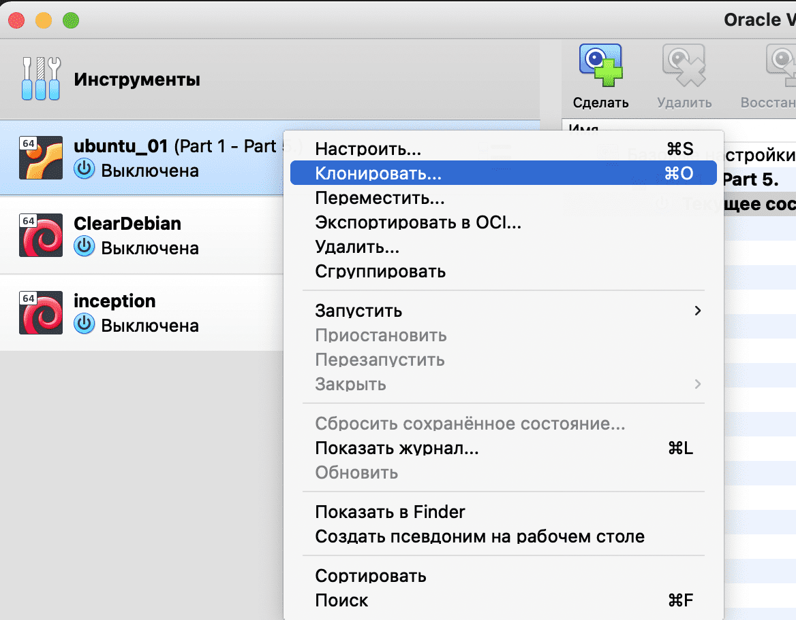

Теперь задаём имя нашей конфигурации - "ws1". В папке goinfre создаём папку с аналогичным именем и указываем её в строке "Путь". Генерируем новые маки для всех адаптеров:

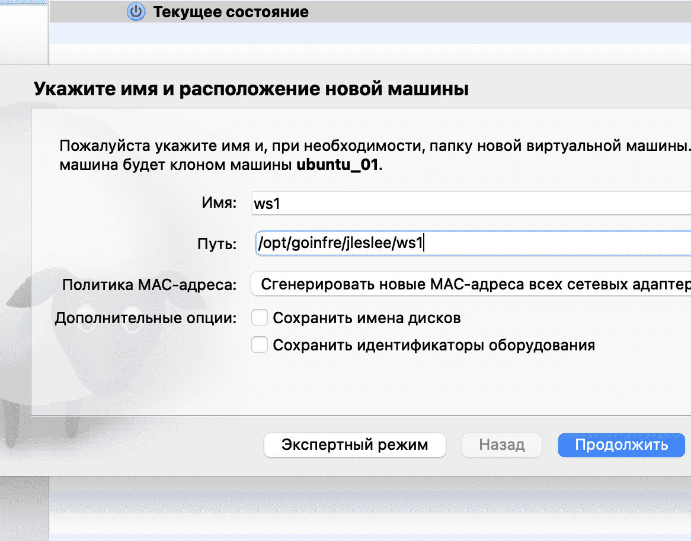

Я выбираю клонировать состояние машины без снимков - "полное клонирование", но при желании можно выбрать опцию "всё" и склонить даже снимки системы.

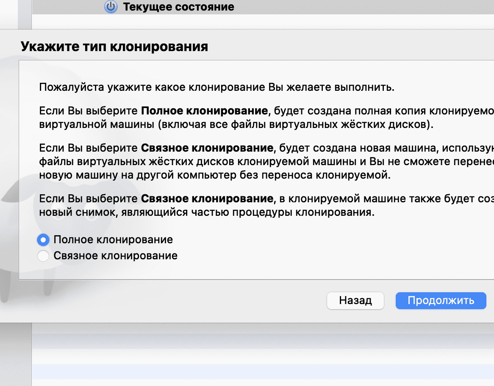

После того, как мы нажмём "продолжить", запустится процесс клонирования, окончания которого будет ожидать вместе с нами овечка Долли:

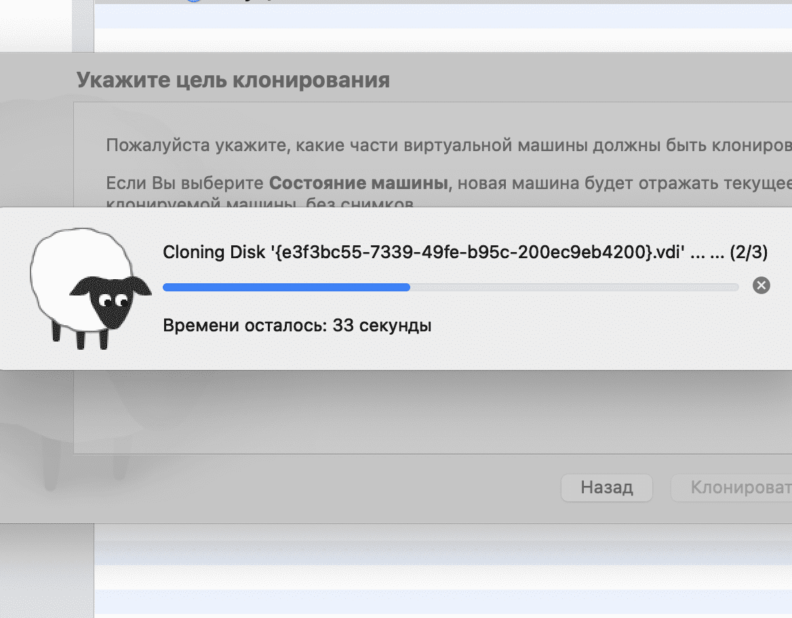

После того, как всё успешно склонировалось, у нас в системе будет уже две виртуалки - ubuntu_01 и ws1:

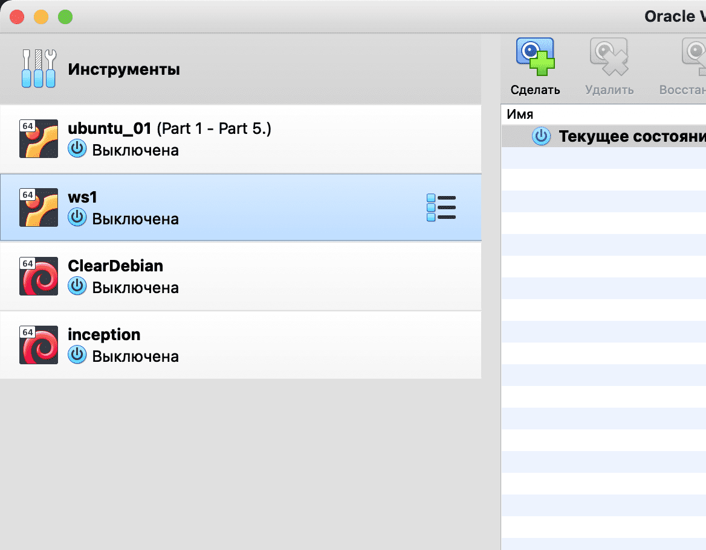

У меня на школьном маке висят ещё и чистый дебиан для проверки различных теорий, а так же школьный проект [inception](https://github.com/codesshaman/inception.git "inception") с тех древних времён, когда "Школа-21" училась по французской франшизе "ecole-42".

Я предпочитаю в качестве серверных ОС более стабильный debian, однако ubuntu на сегодня ~~по какому-то недоразумению~~ самая используемая linux-система и большинство серваков работает на ней, так что никуда не денешься, знать этот дистрибутив необходимо.

### Шаг 2. Настройка клонированной конфигурации.

Теперь заходим в настройки системы и уменьшаем количество оперативной памяти до 512 мегабайт, так как таких систем у нас будет целых пять:

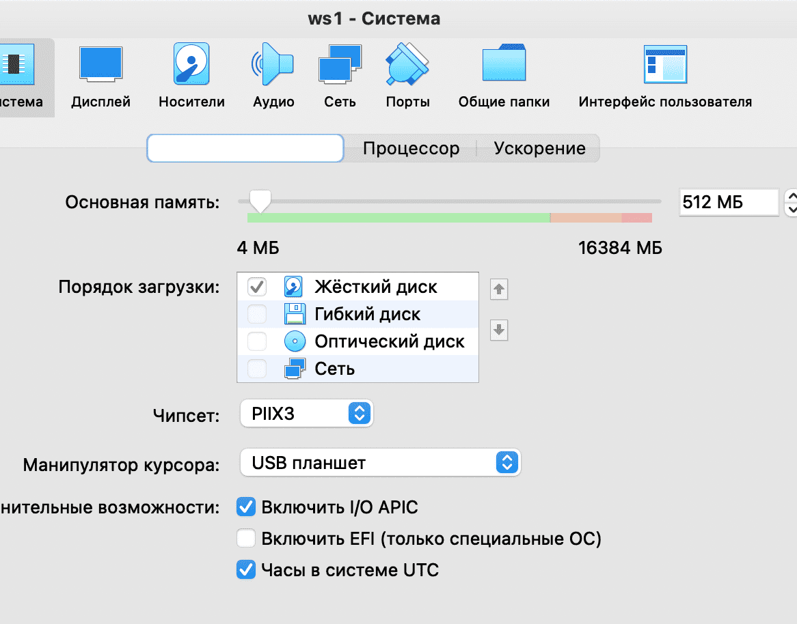

Одного ядра нашей системе теперь будет вполне достаточно:

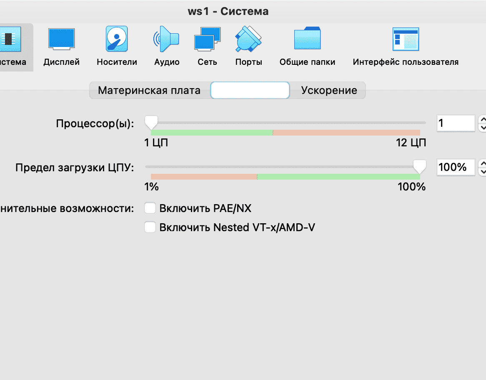

Далее нам нужно зайти в настройки сетей и переадресовать порт, по которому мы будем стучаться в SSHD. Менять настройки SSH мы не будем, порт 2022 оставим на виртуалке, а в с хоста подбросим ему порт 2021.

Лучше всего сразу придумать, какие порты на какую систему мы раскидаем.

Например, я задам следующие соответствия:

- 2020 - ws2
- 2021 - ws1
- 2022 - ubuntu_01
- 2023 - ws11
- 2024 - r2
- 2025 - r1

В моей схеме чётные порты соответствуют чётным номерам виртуальных машин, и наоборот. Ты можешь использовать любые удобные порты и задать их в "Сеть -> Дополнительно -> Проброс портов".

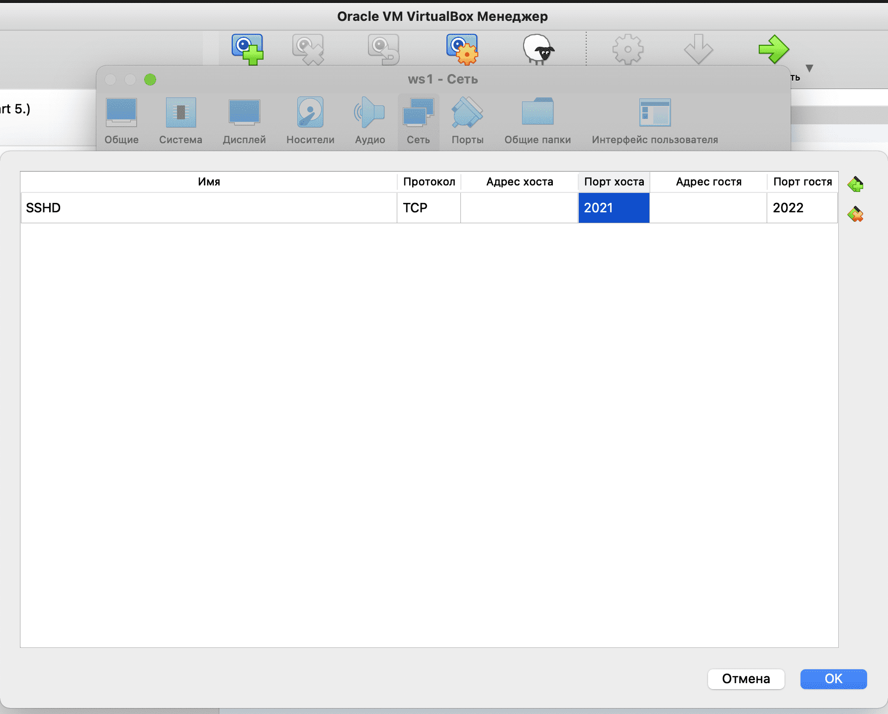

Для проверки подключаемся к серверу по ssh.

``ssh user@localhost -p 2021``

Должна появиться надпись с вопросом, уверены ли мы что хотим соединиться. Вводим "yes" и попадаем на сервер:

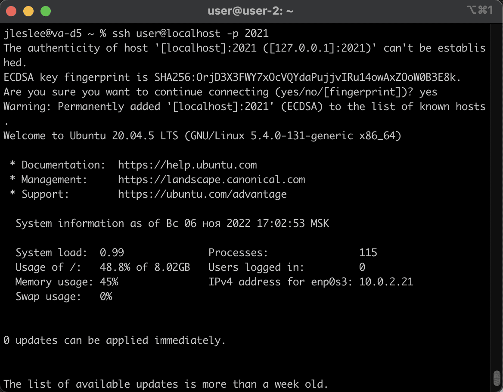

### Шаг 3. Клонируем ws1 и разворачиваем все остальные сервера.

По примеру первых двух шагов мы клонируем наш ws1 и создаём из него ещё четыре машины: ws2, ws11, r1 и r2.

Естественно, для каждой машины должны быть созданы свои папки. Не забываем генерировать новые mac-адреса каждой машине.

После клонирования всё что нам остаётся настроить - это проброс портов на каждой машине. После, когда мы будем настраивать сеть, мы будем задавать им ещё и IP-адреса, но на данном этапе достаточно портов.

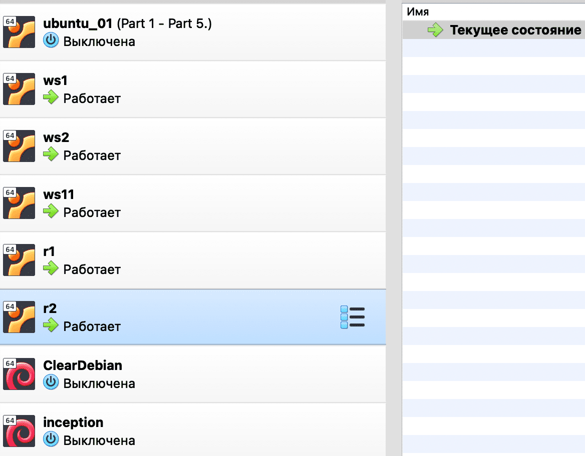

Так же я заменил имя хоста каждой машины на соответствующее:

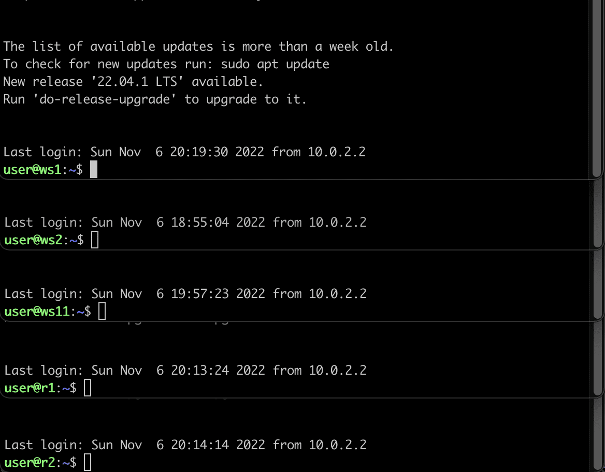

Для одновременного подключения я использую разные порты, так же я заморочился и сохранил все эти конфигурации в облако. Далее я буду докачивать в облако все дополнительные снапшоты. Пока же в каждой системе у меня нет снапшотов - в результате полного клонирования они все записались в текущее состояние системы.

